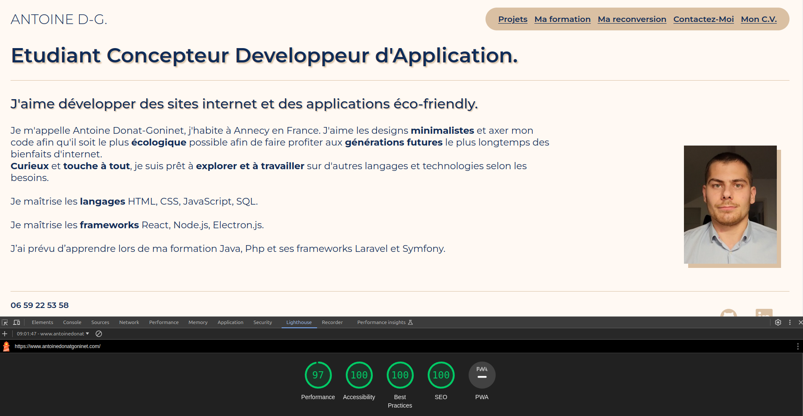
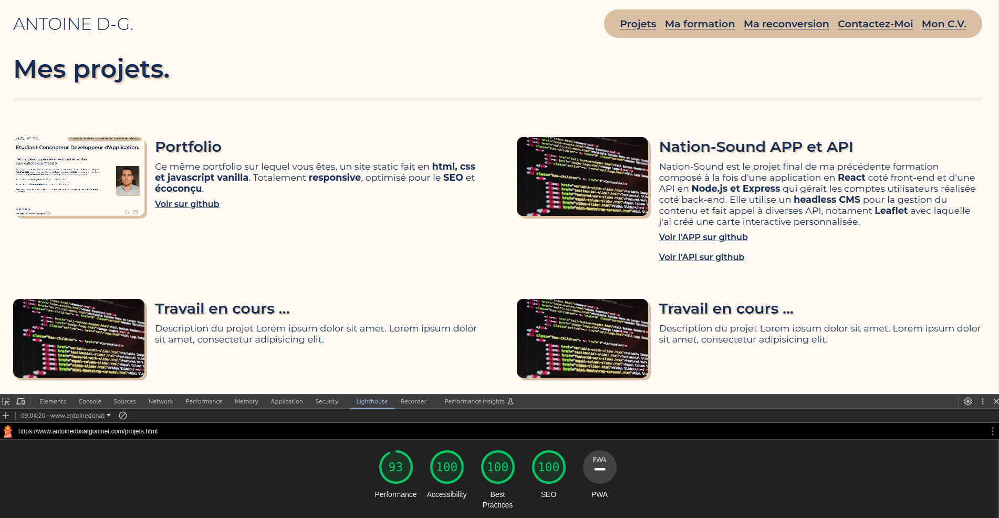
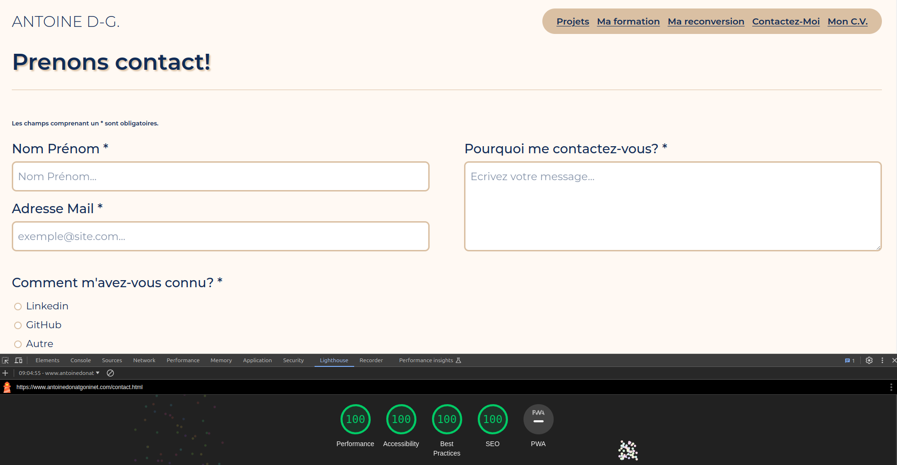

# Mon Portfolio

:pushpin: Site web réalisé uniquement en HTML, CSS et JavaScript, optimisé pour le SEO, l'accessibilité et écoconçu.

## Résultat Google Lighthouse :chart_with_upwards_trend:

## Technologies utilisées :wrench:

- Vanilla HTML.
- Vanilla CSS.
- Vanilla JavaScript.
- Web3Forms : pour la gestion de l'envoie d'emails.

## Déploiement :rocket:

Le déploiement est réalisé avec GitHub pages.

